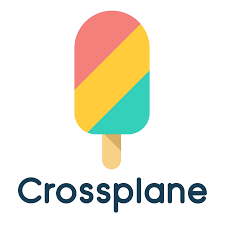

# crossplane-k8s-xrd

Can Crossplane offer the same developer experience as Kubevela?



# Getting started

## Prerequisites

See [local k8s development repo]().

## Create local cluster and install Crossplane

1. Create a Kubernetes cluster: `ctlptl apply -f k8s/kind.yaml && kubectl apply -k k8s`. This will create a local k8s cluster with a built-in container registry and k8s metrics server.
2. Install crossplane: `kubectl kustomize crossplane/crossplane-system --enable-helm | kubectl apply -f - -n crossplane-system`
3. Prepare k8s provider config:
```
SA=$(kubectl -n crossplane-system get sa -o name | grep provider-kubernetes | sed -e 's|serviceaccount\/|crossplane-system:|g')
kubectl create clusterrolebinding provider-kubernetes-admin-binding --clusterrole cluster-admin --serviceaccount="${SA}"
```
4. Install Crossplane k8s provider: `kubectl apply -k crossplane/k8s-provider`

# Crossplane XRD to simplify k8s Deployments

Goal: create all the necessary k8s object (deployment, service, config maps... etc.) by only specifying 1 simple manifast file:

```yaml
apiVersion: apis.intility.no/v1alpha1
kind: FastAPIInstance
metadata:
  namespace: myapp
  name: my-fastapi
spec:
  parameters:
    image: fastapi
```