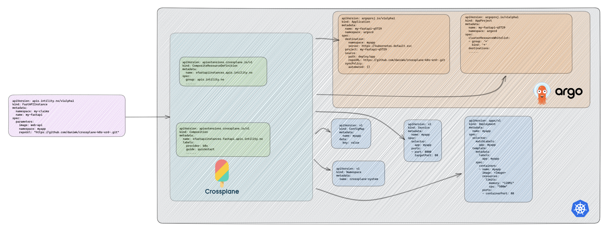

# crossplane-k8s-xrd

Can we use Crossplane to create a better developer experience?

[Crossplane](https://www.crossplane.io/) is a framework to build a cloud-native control plane without writing any code. It allows platform teams to use the k8s' built-in controller and reconciliation loop to manage your infrastructure by defining any infrastructure (Azure SQL, AWS EKS, k8s resources...etc.) as k8s manifest files and applying them your cluster. Head over to [Crossplane doc](https://docs.crossplane.io/v1.10/) to get a better introduction.

My goal here is to play around with Crossplane XRs to see if it can help us standardize and simplify the developer experience when it comes to deploying and managing own software. Can it create the same experience as Kubevela where developer with 1 manifest file creates the necessary, underlying infrastructure such as k8s Deployment, Service and Secrets, ArgoCD project and so on?



## Preliminary conclusion
By leveraging the Crossplane XR functionality in combination with the [Crossplane Kubernetes Provider](https://github.com/crossplane-contrib/provider-kubernetes) it's possible to greatly standardize, automate and simplify management of software infrastructure. This repo's XR creates the following:
 - [x] Namespace
 - [x] Deployment
 - [x] Service
 - [ ] Kong Plugins
 - [x] ArgoCD Project, with RBAC and destination restrictions
 - [x] ArgoCD Application, connected to the Project mentioned above.
 - [ ] Vault Secret

Comments:
- Crossplane XRDs is dearly missing conditionals and iteration functionality. Looks like it will be available in the next release (?) [v1.11](https://youtu.be/a9J3xzb-DZM?t=834). [GitHub issue](https://github.com/crossplane/crossplane/issues/2524).


# Getting started

## Prerequisites

Install kind, ctlptl, kubectl, helm, docker, k9s and Tilt. For installation guide visit this [repo](https://github.com/daniwk/app-scaling-keda#prequisites).

## Create local cluster and install Crossplane

1. Create a Kubernetes cluster: `ctlptl apply -f deploy/k8s/kind.yaml && kubectl apply -k deploy/k8s`. This will create a local k8s cluster with a built-in container registry and k8s metrics server.
2. Install crossplane: `kubectl kustomize deploy/crossplane/crossplane-system --enable-helm | kubectl apply -f - -n crossplane-system`
3. Prepare k8s provider config:
```
SA=$(kubectl -n crossplane-system get sa -o name | grep provider-kubernetes | sed -e 's|serviceaccount\/|crossplane-system:|g')
kubectl create clusterrolebinding provider-kubernetes-admin-binding --clusterrole cluster-admin --serviceaccount="${SA}"
```
4. Install Crossplane k8s provider: `kubectl apply -k deploy/crossplane/k8s-provider`

## Install ArgoCD
1. Install ArgoCD: `kubectl kustomize deploy/argocd --enable-helm | kubectl apply -f - -n argocd`
2. Patch ArgoCD Server service to Load Balancer: `kubectl patch svc argocd-server -n argocd -p '{"spec": {"type": "LoadBalancer"}}'`
3. Port-forward ArgoCD: `kubectl port-forward svc/argocd-server -n argocd 8080:443`
4. Grab the autogenerated admin password `kubectl -n argocd get secret argocd-initial-admin-secret -o jsonpath="{.data.password}" | base64 -d; echo` and log into ArgoCD with the user `admin` on `localhost:8080`.

# Crossplane XRD to simplify k8s Deployments

Goal: create all the necessary k8s object (deployment, service, config maps, ArgoCD Project, ArgoCD Application, etc.) by only specifying 1 simple manifast file:

```yaml
apiVersion: apis.intility.no/v1alpha1
kind: FastAPIInstance
metadata:
  namespace: myapp
  name: my-fastapi
spec:
  parameters:
    image: fastapi
    namespace: myapp
```

1. Run the following to configure the necessary XR: `kubectl apply -k deploy/crossplane/fastapi-xrd/`. 
2. Use Tilt to build the sample api and provision it to your local cluster: `tilt up`. It will first build the container image and push it to the local built-in container registry(see `docker_build` in the Tiltfile), provision the XR (see `deploy/app/claim.yaml`) which creates a new namespace, deployment, service, ArgoCD Project and ArgoCD Application in k8s. Lastly, it replaces the predefined image with the newly, locally built image (see `k8s_kind` in Tiltfile). 
3. Use `k9s` to port-forward so that you can reach the sample web api from the browser or curl.
4. Visit the ArgoCD UI to see that the ArgoCD Project and Application was created.